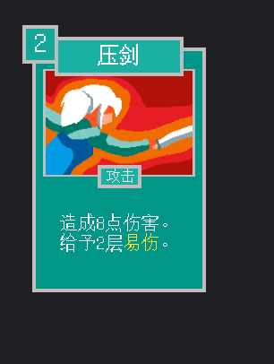
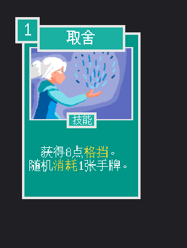
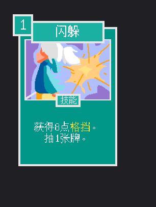
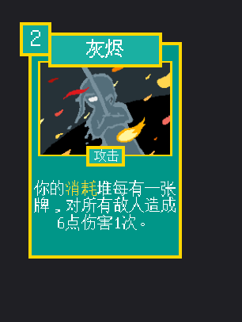
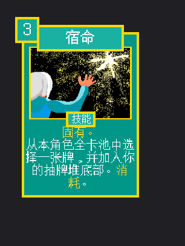
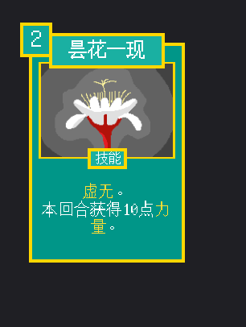
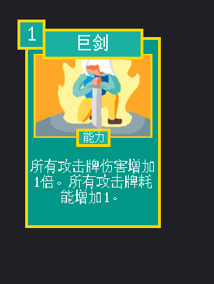

# 卡牌图鉴 · 剑客

## 压剑

攻击 · 起手 · 费用 2 · blade_press_blade

造成8点伤害。
给予2层易伤。

升级后：造成12点伤害。
给予3层易伤。

## 打击

攻击 · 起手 · 费用 1 · blade_strike

造成6点伤害。

升级后：造成9点伤害。

## 防御

技能 · 起手 · 费用 1 · blade_block

获得5点格挡。

升级后：获得8点格挡。

## 舍身技

攻击 · 普通 · 费用 1 · blade_desperate_strike

受到6点伤害。
造成16点伤害。

升级后：受到6点伤害。
造成22点伤害。

## 横扫

攻击 · 普通 · 费用 1 · blade_slash

对所有敌人造成8点伤害。

升级后：对所有敌人造成11点伤害。

## 剑影

攻击 · 普通 · 费用 1 · blade_sword_flash

随机对敌人造成3点伤害3次。

升级后：随机对敌人造成3点伤害4次。

## 取舍

技能 · 普通 · 费用 1 · blade_detachment

获得8点格挡。
随机消耗1张手牌。

升级后：获得10点格挡。
消耗1张手牌。

## 闪躲

技能 · 普通 · 费用 1 · blade_dodge

获得8点格挡。
抽1张牌。

升级后：获得12点格挡。
抽1张牌。

## 看破

技能 · 普通 · 费用 0 · blade_insight

给予2层易伤。
消耗。

升级后：给予3层易伤。
消耗。

## 全力一击

攻击 · 罕见 · 费用 X · blade_all_out

造成9X点伤害。

升级后：造成13X点伤害。

## 心流

技能 · 罕见 · 费用 1 · blade_flow

抽2张牌。
消耗1张手牌。

升级后：抽3张牌。
消耗1张手牌。

## 不动声色

技能 · 罕见 · 费用 2 · blade_imperturbable

获得10点格挡。
下回合获得当前能量值的能量。

升级后：获得15点格挡。
下回合获得当前能量值的能量。

## 起手式

技能 · 罕见 · 费用 3 · blade_opening_stance

获得4点能量。

升级后：获得5点能量。

## 怒火

能力 · 罕见 · 费用 1 · blade_anger

获得2点力量。

升级后：获得3点力量。

## 灰烬

攻击 · 稀有 · 费用 2 · blade_ashes

你的消耗堆每有一张牌，对所有敌人造成6点伤害1次。

## 崩碎

攻击 · 稀有 · 费用 2 · blade_shatter

对所有敌人造成29点伤害。
失去2点力量。

升级后：对所有敌人造成37点伤害。
失去2点力量。

## 宿命

技能 · 稀有 · 费用 3 · blade_destiny

固有。
从本角色全卡池中选择一张牌，并加入你的抽牌堆底部。消耗。

升级后：固有。
从本角色全卡池中选择一张牌，将其升级并加入你的抽牌堆底部。消耗。

## 昙花一现

技能 · 稀有 · 费用 2 · blade_ephemeral_bloom

虚无。
本回合获得10点力量。

升级后：虚无。
本回合获得17点力量。

## 生死流转

技能 · 稀有 · 费用 0 · blade_samsara

变化你消耗堆的所有牌，将它们升级并放入你的抽牌堆。消耗。

升级后：变化你消耗堆的所有牌，将它们升级并放入你的抽牌堆。

## 不屈

技能 · 稀有 · 费用 0 · blade_unyielding

只有当你的生命值不高于10时才能打出。获得45点格挡。

升级后：只有当你的生命值不高于17时才能打出。获得45点格挡。

## 巨剑

能力 · 稀有 · 费用 1 · blade_overwhelming

所有攻击牌伤害增加1倍。所有攻击牌耗能增加1。

升级后：所有攻击牌伤害增加2倍。所有攻击牌耗能增加1。
